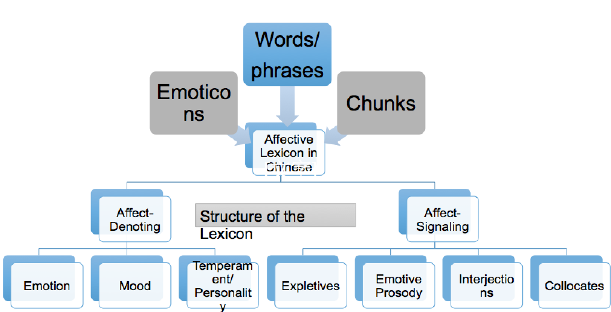
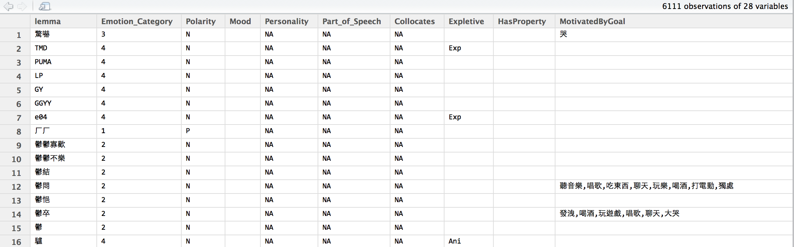
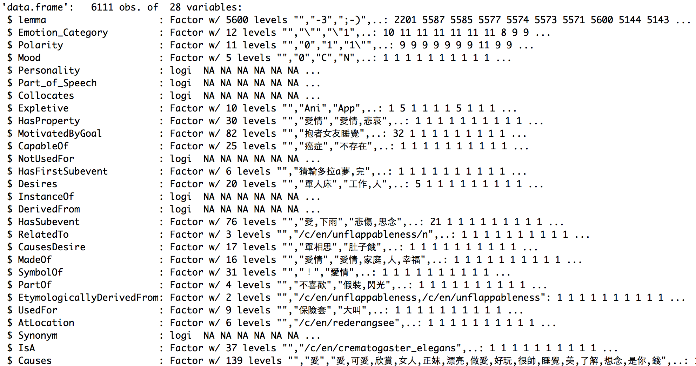

## BIG is easy, DEEP is hard

</img>

--- 
## BIG is easy, DEEP is hard

<iframe width="70" height="40" src="https://www.youtube.com/embed/yyTx6a7VBjg" frameborder="0" allowfullscreen></iframe>


--- .quote


### (Hsieh at al., 2015. to be submitted)
<q>`DeepLEX`: With its modularized open architecture, it aims to be a `fine-grained yet scaled` multilingual lexical resource that empowers linguists to pursuit a wide array of previously unanswerable research questions.
</q>


--- 
## 提醒：詞庫和詞典的基本任務不同
[線上漢語大詞典與康熙字典](http://hd.cnki.net/kxhd/)
</img>
</img>


---
## DeepLEX: Rationale 

> ### - 不同視野下的詞彙行為/知識表徵化 
Operationalized lexical knowledge representation

E.g., 我們不(只)關心「打」的詞義有哪些，更關心
 - 在`什麼標準|脈落`下「打」的詞義分成幾個；
 - 這樣的`標記訊息`(Categorical and/or Numerical) 跟該單位在其他脈絡下被觀察到的行為 (習得，情緒，發展，語言教學，神經表徵，心理反應等) 之間的關聯為何？
 - 以這樣的第二層知識出發提供「語言學養分」給 NLP/Machine Learning (rather than `shallow linguistic feature engineering`)

> ### - 任何的努力都應該被記錄
Reused, Reproduced, Reshaped and Reinforced.


---
## DeepLEX: Assumptions

> * It takes the functional position (usage-based view) in determining units and patterns (in Chinese), as well as the ontological grounding on the relation between linguistic objects and situations (bits of reality). (Langacker 1987, 1988, 1999; Croft 2002; Tomasello 2003; Bybee 2006, 2010)

> * Lexical data at different levels are modularized (only for practical reasons), such as syntax-semantics module, emotion module, discourse and pragmatic module, diachronic module, etc. Researchers from different fields can initiate a new cooperation based upon. 


---
## Modules


Hanzi         | Semantics    |  Emotion | Lexical.Age | Aquisition | Social Network | .........
------------- | -------------|----------|-------------|------------|----------------|----
phonetics     | sense        |polarity  |1930.freq    | 3y.freq    |indegree        |----
components    | relations    |classes   |1940.freq    | 4y.freq    |----------------|----


At the moment there are 45k units (ranging from characters to lexical chunks) with over than 140 variables. The scope and size are still evolving, with its concerted and long-term efforts we believe this resource will be valuable for deep processing of natural language processing and intelligent applications.


--- &twocol_dynamic w1:30% w2:66%

## 模組化的詞彙知識
### 開放集合


*** =left
### 
 * `Morpho-Syn-Sem module`
 * `Affective module`
 * `Diachronic module`
 * `Stance module`
 * `Morphemes (Hanzi) module`
 * `Frequency module`

--- &twocol_dynamic w1:30% w2:66%

## 模組化的詞彙知識
### 開放集合

*** =left
### 
 * `Morpho-Syn-Sem`
 * `Affective module`
 * `Diachronic module`
 * `Stance module`
 * `Morphemes (Hanzi)`
 * `Frequency module`


*** =right
### Possible values

 * collocates, arguments, familiarity ratings, polarity, length, senses, ontological class, pos, estimated ages, discourse markers, ...........


---
## Affective module as an Example

</img>


---
```{r eval=FALSE}
affect <- read.csv("~/LOPEN/BIGLEXICON/modules/emotion/data/affect.0.csv")
View(affect)
head(str(affect),10)
```
</img>
</img>


---
## Summary: `Deep and Big` in what sense
* Deep: unlimited dimensions (currently more than 140 indi. variables)
* Big: *continuous* in units (currently more than 45k lexical units)
  - non-word morpheme
  - lexical chunks: frequent word strings of compositional nature (e.g. don't have to worry)
  - formulaic sequences, idioms, and other multi-word expressions.


--- 
## Current Development

* [**Tools and APIs**] `R` 的套件 (`LexicoR`): provides *programmable* tools for aggregating, exploring, visualizing, and modeling the lexical data, as well as various quantitative measures for working with the data in reproducible manner.
* [**Annotation**] [標記平台](http://lopen.linguistics.ntu.edu.tw/emilytagger/) 
* [**Market**] [資料集散](http://140.112.147.131:5000/)


---
## DeepLEX-based Applications | 應用

* Sentiment/Emotion Detection already on the way (Magistry et al. 2015).
* You are now empowered to ask DIFFERENT questions.

  * `詞彙難易`與那些變項有關？
  * 情緒詞彙的漢字部首/部件組合的關係？
  * 那些變項|組合最大地決定了`詞彙年齡` (存活能力) ? 
  

---
## Modeling the Life Stage of Diffusion, Stabilization, Inactivation of words

$$latex
\min_{\beta_0,\beta} \frac{1}{N}\sum_{i=1}^N w_il(y_i,\beta_0+\beta^Tx_i)+\lambda \left[(1-\alpha) ||\beta||_2^2/2+\alpha||\beta||_1\right]
$$


```{r block2, fig.width=8, fig.height=5, echo=FALSE}
library(glmnet)
load("QSExample.RData")
fit = glmnet(x, y)
plot(fit)
```


---
## The Future is Now, The Sky is the Limit

> * Crowd (-sourced) Annotation 眾標
  - `期待聰明的解法：無相布施 (annotation)`

> * Make it open before make it right 
  - [萌典](https://www.moedict.tw) 是個好例子。


--- {class: class1, bg: yellow, id: id1}
## Conclusion

* 我們需要知道為什麼。

Re-evaluate the role of linguistics/linguistic annotation in the era of Machine Learning.

* 跨界合作眾志成城的時代已然來臨。

`Crossover` is in: collaboration is needed, Public Sharing is crucial. Time to discover and explore the Wisdom of Linguistic Crowds

[Developer mailing list](lopendev@googlegroups.com)

---
## Reference

[Mcnamara et al,2014] Automated evaluation of text and discourse with Coh-Metrix. Cambridge.

[Pennebaker et al. 2001] Linguistic inquiry and word count: LIWC 2001. *Mahway: Lawrence Erlbaum Associates, 71*.

[Tausczik et al. 2010] The Psychological Meaning of Words: LIWC and Computerized Text Analysis Methods. *Journal of Language and Social Psychology, 29(1) 24–54*.

[Chang et al. 2015] A psycholinguistic database for traditional Chinese character naming. *Behavior Research Methods*.

[Sze et al. 2013] The Chinese Lexicon Project: A repository of lexical decision behavioral responses for 2,500 Chinese characters. *Behavior Research Methods.*

[Magistry et al. 2015] Sentiment Detection in Micro-blogs Using Unsupervised Chunks Extraction. *CLSW 2015* (accepted). 

--- {class: class1, bg: Crimson, id: id1}
## Acknowledgement


> 王伯雅：歷時模組

> 呂珮瑜：情緒模組

> 莊茹涵：語用模組

> 秦睿謙/林欣霓：漢字模組

> CWN2 Group：詞彙語意模組

> 劉純睿，Pierre Magistry，張瑜芸，施孟賢，. . . . 所有 LOPE lab 的成員！


